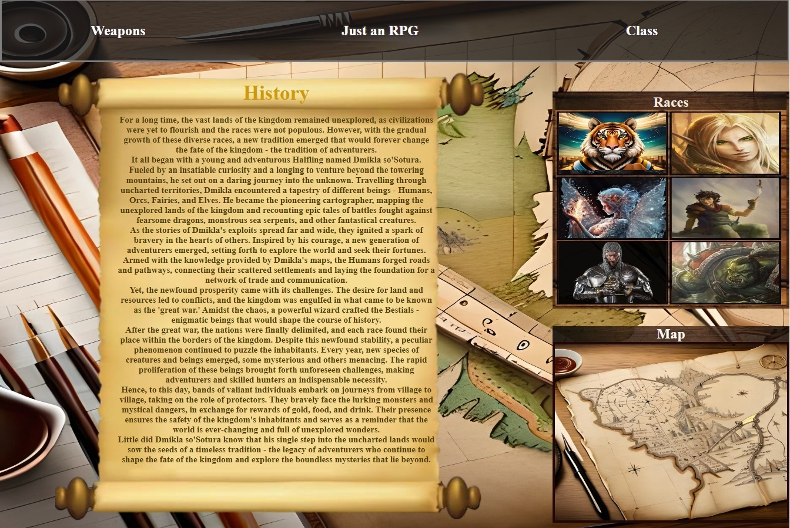
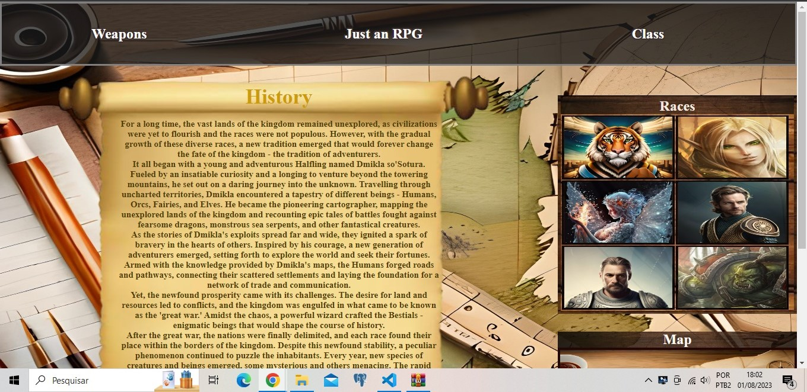
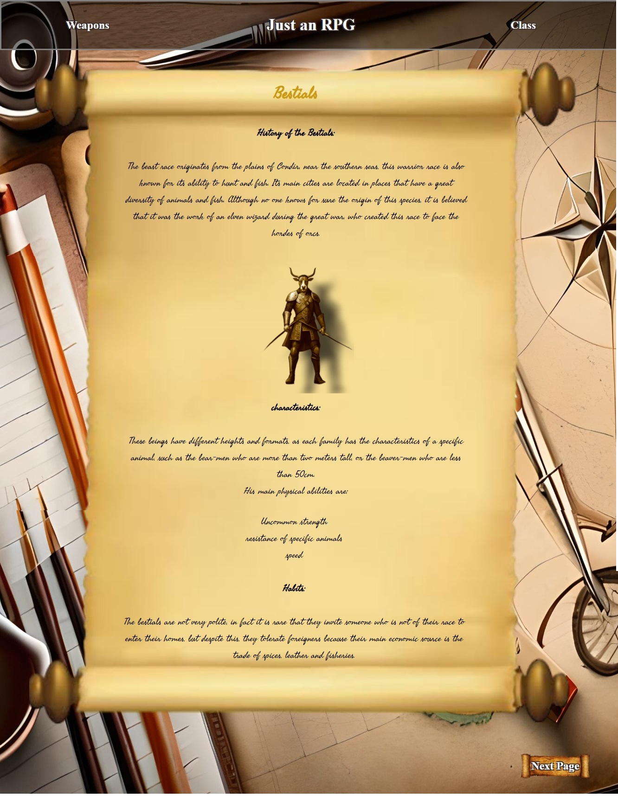
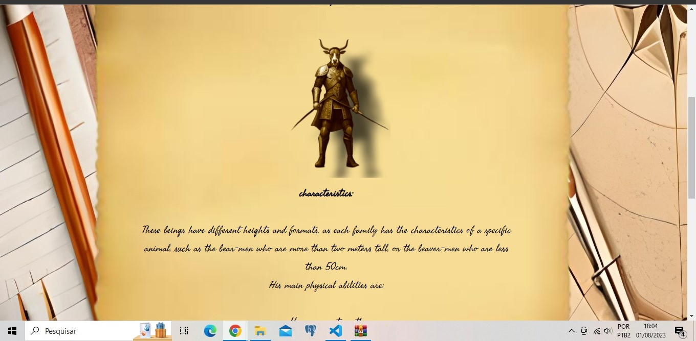
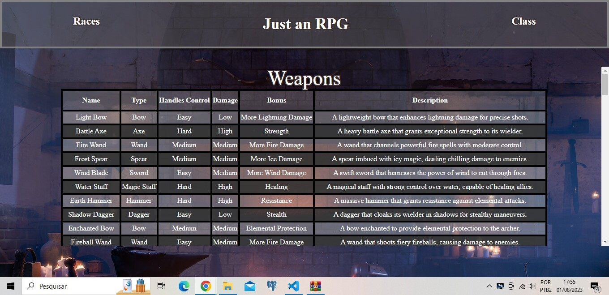
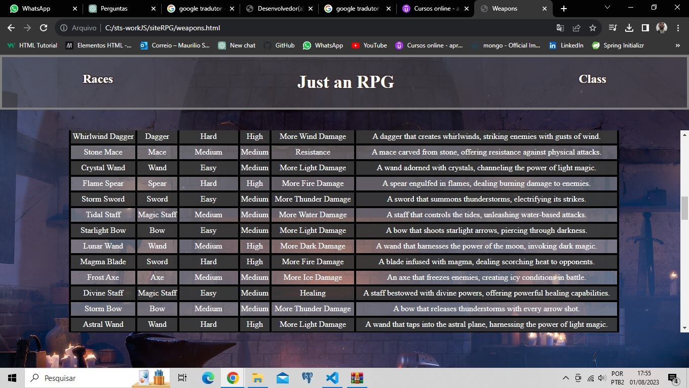

# RPG Site

## index
- <a href="#AbautTheProject">About the project</a>
- <a href="#layout"> Layout </a>
- <a href="#tecnologies">Technologies</a>
- <a href="nextSteps">Next Steps</a>
- <a href="AboutTheCreator">About the Creators</a>

# About the project

This site is the first created as part of my front-end portfolio.
The project is a reflection of the knowledge acquired during the **Udemy HTML and CSS course**.

# Layout

Full website homepage.

Homepage window.

Full races page.

Race page window.

weapons page windows.

race page continuation window.

# Tecnologies

- HTML
- CSS

The site was built using HTML for structuring web content and CSS for styling and visual appearance. HTML defines the page structure, while CSS enhances the design with colors, fonts, and layouts. This combination allows for dynamic and interactive web applications, providing an optimal user experience.

# Next Steps

JavaScript functionality will be added to the site to handle user registration and increase the interactivity of the map page. Users can register and log in to access exclusive pages of RPG cities and kingdoms, making the experience more immersive and immersive. These additions bring a dynamic feel to the site, offering a seamless and interactive journey for RPG enthusiasts.

# About the creators

Linkedin Page: <a href="https://www.linkedin.com/in/maur%C3%ADlio-souza-29a14b275/">Maurílio Souza</a>;

GitHub Page: <a href="https://github.com/SouzaSMaurilio">SouzaSMaurilio</a>;